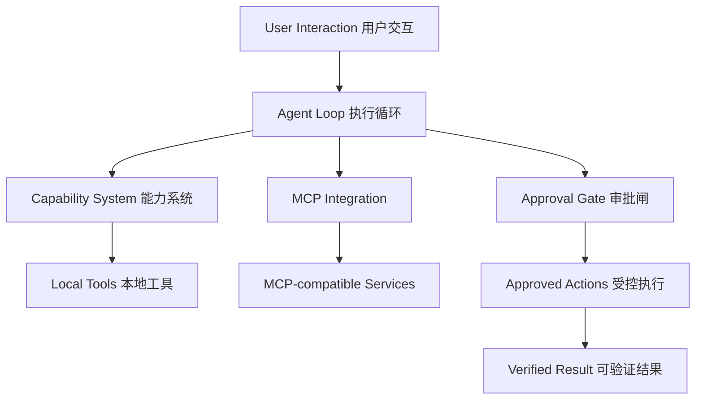

# Bedrock Agent v0.6.0

> A local-first AI Agent runtime built around capabilities, tool execution, MCP integration, approval gates, and verifiable workflows.
> 一个围绕能力系统、工具执行、MCP 集成、审批闸与可验证工作流构建的本地优先 AI Agent 运行时。


---

## Overview / 项目概述

**EN** — Bedrock Agent is a local-first AI Agent runtime focused on reliable agent workflows with explicit capabilities, tool execution, security boundaries, and verification-oriented development. Instead of treating an Agent as only a chat interface, it explores the engineering layers required for practical AI systems.

**中文** — Bedrock Agent 是一个本地优先的 AI Agent 运行时，聚焦于「可靠的 Agent 工作流」：显式的能力系统、工具执行、安全边界与以验证为导向的开发方式。它不把 Agent 仅仅当作一个聊天界面，而是探索构建实用 AI 系统真正需要的工程层。

- Agent execution loop / Agent 执行循环
- Capability-based tool organization / 基于能力系统的工具组织
- MCP integration / MCP 协议集成
- Security & approval gates / 安全与审批闸
- Persistent memory & skills / 持久记忆与技能
- Local workspace management / 本地工作区管理
- Desktop (QML) components / 桌面（QML）组件

> Development principle / 开发原则：
> **User-driven design and validation, AI-assisted implementation, versioned releases verified before publication.**
> **用户主导设计与验证，AI 辅助实现，每个版本验证通过后才发布。**

## Architecture / 架构



### Agent Loop / 执行循环
Coordinates input handling, reasoning flow, capability selection, tool execution, and result processing — keeping the execution flow explicit and inspectable.
协调输入处理、推理流转、能力选择、工具执行与结果处理，让整条执行链路显式、可检查。

### Capability System / 能力系统
Modular extension model: actions are organized as capabilities instead of being hardcoded into the core loop.
模块化的扩展模型：功能以「能力」为单位组织，而不是把每个动作都写死在核心循环里。

### MCP Integration / MCP 集成
Connects Agent capabilities to external tools through standardized MCP interfaces. See [`MCP.md`](MCP.md).
通过标准化 MCP 接口将 Agent 能力对接外部工具。详见 [`MCP.md`](MCP.md)。

### Security Model / 安全模型
When generated decisions trigger execution directly, unintended actions can happen. Bedrock Agent introduces explicit control points (approval gates) before sensitive actions, plus an app allowlist for desktop control. See [`SECURITY.md`](SECURITY.md).
当模型生成的决策直接驱动执行时，误操作不可避免。Bedrock Agent 在敏感动作前加入显式控制点（审批闸），并对桌面应用实施白名单管理。详见 [`SECURITY.md`](SECURITY.md)。

## Quick Start / 快速开始

```bash
# 1. Clone / 克隆仓库
git clone https://github.com/rfgttt/bedrock-agent.git
cd bedrock-agent

# 2. Environment / 创建环境
python -m venv .venv
.venv\Scripts\activate          # Windows / 或 source .venv/bin/activate
python -m pip install -e ".[dev,mcp,desktop]"
copy .env.example .env          # 填入你自己的模型配置 / add your model config

# 3. Run the test suite / 运行测试
pytest

# 4. Launch desktop / 启动桌面端
bedrock-desktop
```

Expected / 预期结果:

```
67 passed
```

## Release Engineering / 发布工程

**EN** — One of the main engineering focuses of this project is repeatable, verifiable version delivery. The project went through 16 versioned patch packages (v0.3.1 → v0.6.0), each containing:

**中文** — 本项目最重要的工程重点之一是「可重复、可验证的版本交付」。项目经历了 16 个版本化补丁包（v0.3.1 → v0.6.0），每个补丁包都包含：

- `apply.ps1` — apply the patch / 应用补丁
- `verify.ps1` — verify the result / 验证结果
- `rollback.ps1` — roll back if needed / 回滚
- `SHA256SUMS.txt` — integrity checksums / 完整性校验

Updates are reproducible, changes are verifiable, failures are rollback-able — this is the biggest differentiator of this repository compared to typical personal projects.
更新可复现、改动可验证、失败可回滚——这是本仓库与一般个人项目最大的差异点。

### Notable milestones / 关键版本节点

- **v0.5.0 — QML desktop**: frontend rebuilt on PySide6 + QML (task prism, per-page lazy loading, incremental chat rendering); the legacy Tkinter frontend is kept as `bedrock-desktop-legacy`. See [`FRONTEND.md`](FRONTEND.md).
  桌面端重构为 PySide6 + QML：任务棱镜、页面按需加载、对话增量渲染；旧 Tkinter 前端保留为 `bedrock-desktop-legacy`。
- **v0.5.1 — QML syntax guard**: added a static QML syntax regression test after a Qt 6.11 parsing issue, preventing the same class of errors from entering future patches.
  新增 QML 静态语法守卫测试，防止同类解析错误再次进入补丁。
- **v0.5.2 — 3D task prism**: interactive `PathView` card carousel (drag / wheel / keys), max 7 instantiated cards, no idle animation.
  任务棱镜升级为可交互 3D 卡片轮播，最多实例化 7 张卡片，无数据变化时零持续动画。
- **v0.6.0 — current released state**: memory & skills, workspace import, pending-approval flow, model config, performance tests.
  当前发布态：持久记忆与技能、工作区导入、待审批流、模型配置、性能测试。

## Documentation / 文档

| File | Content / 内容 |
|---|---|
| [`SECURITY.md`](SECURITY.md) | Security model & approval design / 安全模型与审批设计 |
| [`CAPABILITIES.md`](CAPABILITIES.md) | Capability system / 能力系统 |
| [`MCP.md`](MCP.md) | MCP integration / MCP 集成 |
| [`DESKTOP.md`](DESKTOP.md) | Desktop components / 桌面组件 |
| [`FRONTEND.md`](FRONTEND.md) | QML frontend details / QML 前端详解 |
| [`LEARNING.md`](LEARNING.md) | Learning workflow / 学习工作流 |
| [`WORKSPACE.md`](WORKSPACE.md) | Workspace concepts / 工作区概念 |

## Project Philosophy / 项目定位

**EN** — Bedrock Agent is developed with a human-in-the-loop approach: AI tools assist implementation, but architecture decisions, validation criteria, and release verification remain human-controlled. It does not present itself as an autonomous production framework — it is a carefully engineered personal Agent runtime exploring practical Agent system design.

**中文** — Bedrock Agent 采用「人在环」的开发方式：AI 工具辅助实现，但架构决策、验证标准与发布把关始终由人控制。它不把自己包装成全自主的生产级框架——它是一个认真做工程的个人 Agent 运行时，用于探索实用的 Agent 系统设计。

## Transparency / 透明度说明

This repository's public history begins with a single initial import commit of the released v0.6.0 state. The 16 patch packages (apply / verify / rollback / SHA256SUMS) are the authentic record of the incremental release process that preceded this import. No staged development history is fabricated.

本仓库的公开历史以 v0.6.0 发布态的一次性初始导入开始；此前的渐进式发布过程由 16 个补丁包（应用/验证/回滚/校验和）作为真实记录，不虚构渐进开发史。

## Security Notes / 安全须知

Do not commit private runtime data, real `.env` files, or secrets. Use `.env.example` as the configuration template.
不要提交运行数据、真实 `.env` 文件或任何密钥。配置示例一律使用 `.env.example` 模板。

## License / 许可证

TBD — candidates: MIT (simple and permissive / 简单宽松), Apache-2.0 (explicit patent grant / 含专利授权), GPL-3.0 (copyleft / 强制开源衍生).
