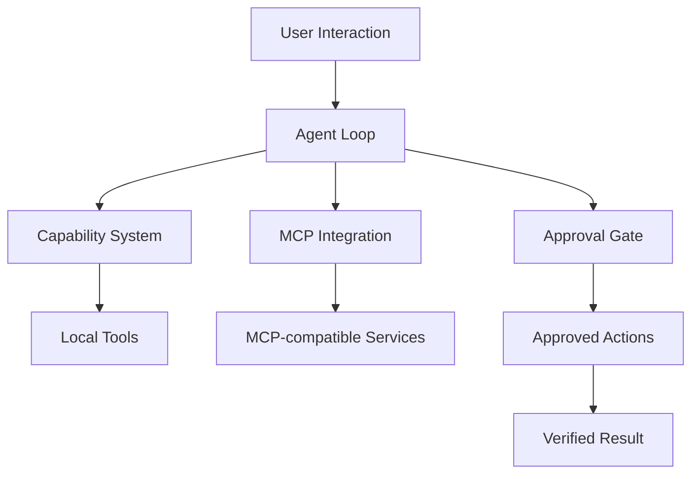

# Bedrock Agent v0.6.0

**English | [中文](README.zh-CN.md)**

> A local-first AI Agent runtime built around capabilities, tool execution, MCP integration, approval gates, and verifiable workflows.


## Overview

Bedrock Agent is a local-first AI Agent runtime focused on reliable agent workflows with explicit capabilities, tool execution, security boundaries, and verification-oriented development. Instead of treating an Agent as only a chat interface, it explores the engineering layers required for practical AI systems.

- Agent execution loop
- Capability-based tool organization
- MCP integration
- Security & approval gates
- Persistent memory & skills
- Local workspace management
- Desktop (QML) components

> Development principle:
> **User-driven design and validation, AI-assisted implementation, versioned releases verified before publication.**

## Architecture



### Agent Loop
Coordinates input handling, reasoning flow, capability selection, tool execution, and result processing — keeping the execution flow explicit and inspectable.

### Capability System
Modular extension model: actions are organized as capabilities instead of being hardcoded into the core loop.

### MCP Integration
Connects Agent capabilities to external tools through standardized MCP interfaces. See [`MCP.md`](MCP.md).

### Security Model
When generated decisions trigger execution directly, unintended actions can happen. Bedrock Agent introduces explicit control points (approval gates) before sensitive actions, plus an app allowlist for desktop control. See [`SECURITY.md`](SECURITY.md).

## Quick Start

```bash
# 1. Clone
git clone https://github.com/rfgttt/bedrock-agent.git
cd bedrock-agent

# 2. Environment
python -m venv .venv
.venv\Scripts\activate          # or: source .venv/bin/activate
python -m pip install -e ".[dev,mcp,desktop]"
copy .env.example .env          # add your model configuration

# 3. Run the test suite
pytest
# Expected: all tests pass

# 4. Launch desktop
bedrock-desktop
```

## Release Engineering

One of the main engineering focuses of this project is repeatable, verifiable version delivery. The project went through 16 versioned patch packages (v0.3.1 → v0.6.0), each containing:

- `apply.ps1` — apply the patch
- `verify.ps1` — verify the result
- `rollback.ps1` — roll back if needed
- `SHA256SUMS.txt` — integrity checksums

Updates are reproducible, changes are verifiable, failures are rollback-able — this is the biggest differentiator of this repository compared to typical personal projects.

### Notable milestones

- **v0.5.0 — QML desktop**: frontend rebuilt on PySide6 + QML (task prism, per-page lazy loading, incremental chat rendering); the legacy Tkinter frontend is kept as `bedrock-desktop-legacy`. See [`FRONTEND.md`](FRONTEND.md).
- **v0.5.1 — QML syntax guard**: added a static QML syntax regression test after a Qt 6.11 parsing issue, preventing the same class of errors from entering future patches.
- **v0.5.2 — 3D task prism**: interactive `PathView` card carousel (drag / wheel / keys), max 7 instantiated cards, no idle animation.
- **v0.5.3 — Conversation UX**: chat message role/layout refinement in the QML frontend, with viewmodel-mapping regression tests.
- **v0.6.0 — current released state**: memory & skills, workspace import, pending-approval flow, model config, performance tests.

## Documentation

| File | Content |
|---|---|
| [`SECURITY.md`](SECURITY.md) | Security model & approval design |
| [`CAPABILITIES.md`](CAPABILITIES.md) | Capability system |
| [`MCP.md`](MCP.md) | MCP integration |
| [`DESKTOP.md`](DESKTOP.md) | Desktop components |
| [`FRONTEND.md`](FRONTEND.md) | QML frontend details |
| [`LEARNING.md`](LEARNING.md) | Learning workflow |
| [`WORKSPACE.md`](WORKSPACE.md) | Workspace concepts |

## Project Philosophy

Bedrock Agent is developed with a human-in-the-loop approach: AI tools assist implementation, but architecture decisions, validation criteria, and release verification remain human-controlled. It does not present itself as an autonomous production framework — it is a carefully engineered personal Agent runtime exploring practical Agent system design.

## Transparency

This repository's public history begins with a single initial import commit of the released v0.6.0 state. The 16 patch packages (apply / verify / rollback / SHA256SUMS) are the authentic record of the incremental release process that preceded this import. No staged development history is fabricated.

## Security Notes

Do not commit private runtime data, real `.env` files, or secrets. Use `.env.example` as the configuration template.

## License

This project is licensed under the [MIT License](LICENSE).

Third-party dependencies retain their respective licenses. For example, PySide6 is distributed under the LGPL-3.0 license and is not covered by this project's MIT license.
中文说明见 [README.zh-CN.md](README.zh-CN.md)。
