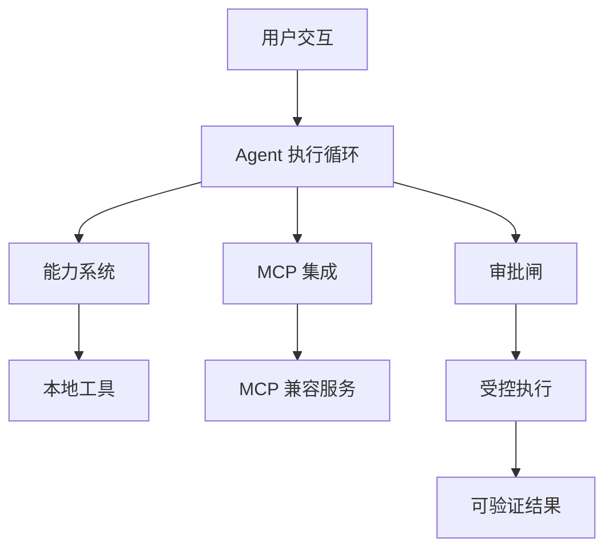

# Bedrock Agent v0.6.0

**[English](README.md) | 中文**

> 一个围绕能力系统、工具执行、MCP 集成、审批闸与可验证工作流构建的本地优先（local-first）AI Agent 运行时。


## 项目概述

Bedrock Agent 是一个本地优先的 AI Agent 运行时，聚焦于「可靠的 Agent 工作流」：显式的能力系统、工具执行、安全边界与以验证为导向的开发方式。它不把 Agent 仅仅当作一个聊天界面，而是探索构建实用 AI 系统真正需要的工程层。

- Agent 执行循环
- 基于能力系统的工具组织
- MCP 协议集成
- 安全与审批闸
- 持久记忆与技能
- 本地工作区管理
- 桌面（QML）组件

> 开发原则：
> **用户主导设计与验证，AI 辅助实现，每个版本验证通过后才发布。**

## 架构



### Agent 执行循环
协调输入处理、推理流转、能力选择、工具执行与结果处理——让整条执行链路显式、可检查。

### 能力系统
模块化的扩展模型：功能以「能力」为单位组织，而不是把每个动作都写死在核心循环里。

### MCP 集成
通过标准化 MCP 接口将 Agent 能力对接外部工具。详见 [`MCP.md`](MCP.md)。

### 安全模型
当模型生成的决策直接驱动执行时，误操作不可避免。Bedrock Agent 在敏感动作前加入显式控制点（审批闸），并对桌面应用实施白名单管理。详见 [`SECURITY.md`](SECURITY.md)。

## 快速开始

```bash
# 1. 克隆仓库
git clone https://github.com/rfgttt/bedrock-agent.git
cd bedrock-agent

# 2. 创建环境
python -m venv .venv
.venv\Scripts\activate          # 或 source .venv/bin/activate
python -m pip install -e ".[dev,mcp,desktop]"
copy .env.example .env          # 填入你自己的模型配置

# 3. 运行测试
pytest
# 预期结果：67 passed

# 4. 启动桌面端
bedrock-desktop
```

## 发布工程

本项目最重要的工程重点之一是「可重复、可验证的版本交付」。项目经历了 16 个版本化补丁包（v0.3.1 → v0.6.0），每个补丁包都包含：

- `apply.ps1` —— 应用补丁
- `verify.ps1` —— 验证结果
- `rollback.ps1` —— 失败回滚
- `SHA256SUMS.txt` —— 完整性校验

更新可复现、改动可验证、失败可回滚——这是本仓库与一般个人项目最大的差异点。

### 关键版本节点

- **v0.5.0 —— QML 桌面端**：前端重构为 PySide6 + QML（任务棱镜、页面按需加载、对话增量渲染）；旧 Tkinter 前端保留为 `bedrock-desktop-legacy`。详见 [`FRONTEND.md`](FRONTEND.md)。
- **v0.5.1 —— QML 语法守卫**：在一次 Qt 6.11 解析问题之后新增 QML 静态语法回归测试，防止同类错误再次进入补丁。
- **v0.5.2 —— 3D 任务棱镜**：可交互 `PathView` 卡片轮播（拖拽 / 滚轮 / 方向键），最多实例化 7 张卡片，无数据变化时零持续动画。
- **v0.6.0 —— 当前发布态**：持久记忆与技能、工作区导入、待审批流、模型配置、性能测试。

## 文档

| 文件 | 内容 |
|---|---|
| [`SECURITY.md`](SECURITY.md) | 安全模型与审批设计 |
| [`CAPABILITIES.md`](CAPABILITIES.md) | 能力系统 |
| [`MCP.md`](MCP.md) | MCP 集成 |
| [`DESKTOP.md`](DESKTOP.md) | 桌面组件 |
| [`FRONTEND.md`](FRONTEND.md) | QML 前端详解 |
| [`LEARNING.md`](LEARNING.md) | 学习工作流 |
| [`WORKSPACE.md`](WORKSPACE.md) | 工作区概念 |

## 项目定位

Bedrock Agent 采用「人在环」的开发方式：AI 工具辅助实现，但架构决策、验证标准与发布把关始终由人控制。它不把自己包装成全自主的生产级框架——它是一个认真做工程的个人 Agent 运行时，用于探索实用的 Agent 系统设计。

## 透明度说明

本仓库的公开历史以 v0.6.0 发布态的一次性初始导入开始；此前的渐进式发布过程由 16 个补丁包（应用 / 验证 / 回滚 / 校验和）作为真实记录，不虚构渐进开发史。

## 安全须知

不要提交运行数据、真实 `.env` 文件或任何密钥。配置示例一律使用 `.env.example` 模板。

## 许可证

待定（TBD）——候选：MIT（简单宽松）、Apache-2.0（含专利授权）、GPL-3.0（强 copyleft）。
